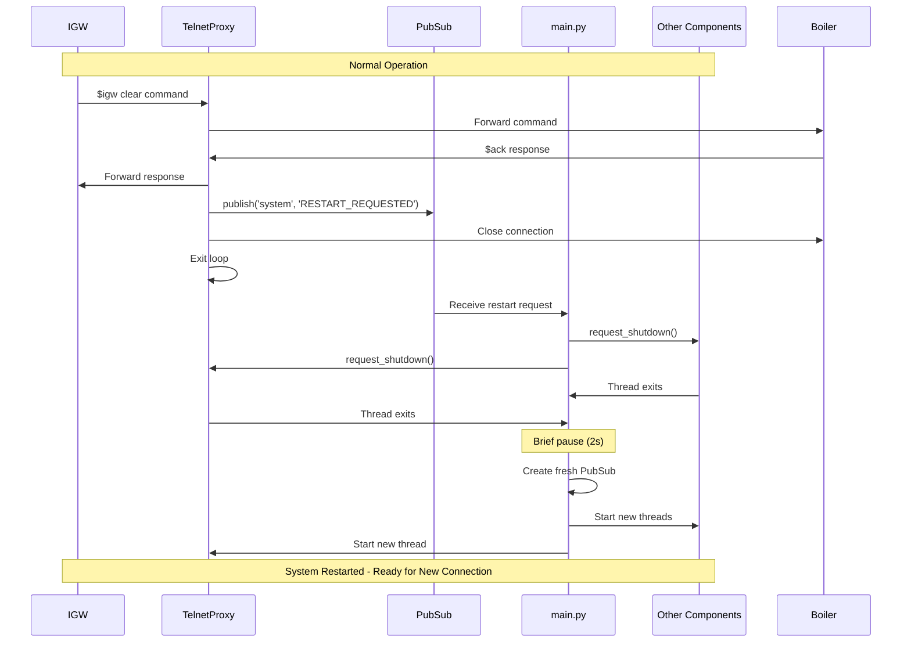
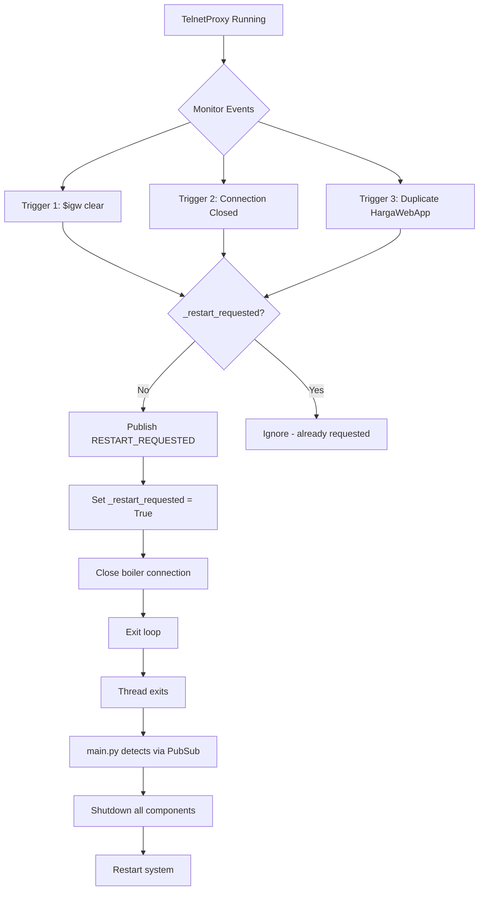
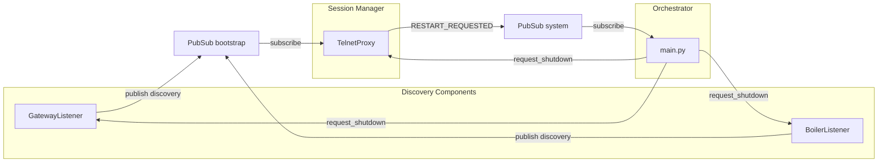

# Technical Strategy: Bug #1 Resolution

**Bug:** [Mishandling of $dhcp renew and $igw clear](https://github.com/hlehoux2021/MyHargassner/issues/1)

---

## Bug Summary

**What are the problems shown by this bug:**

- **Problem 1:** MyHargassner fails when IGW closes its telnet connection after sending `$dhcp renew` or `$igw clear` commands
- **Problem 2:** TelnetProxy attempts internal restart without clearing system state, causing desynchronization between IGW's connection lifecycle and MyHargassner's internal state
- **Problem 3:** When IGW reconnects with a new UDP broadcast "HargaWebApp", MyHargassner cannot properly handle the new connection because components are stuck in stale state
- **Problem 4:** MqttInformer and other components receive duplicate initialization messages when IGW reconnects, potentially corrupting their state machines

---

## Solution Overview

**How we'll solve it:**

Implement system-wide restart orchestrated by main.py whenever IGW ends a connection session. TelnetProxy will detect three session-end triggers (`$igw clear` command, connection closed, or new "HargaWebApp" broadcast) and request restart via PubSub. Main.py will gracefully shutdown all components and restart the entire system with fresh state, mirroring the natural IGW-to-Boiler connection lifecycle.

**Key decisions:**

1. **System-wide restart instead of component-level recovery** - Each IGW connection is treated as a complete system session. When IGW disconnects, all components restart with clean state rather than attempting internal recovery. This mirrors the direct IGW-to-Boiler behavior and prevents state desynchronization.

2. **TelnetProxy as sole restart trigger source** - Only TelnetProxy publishes `RESTART_REQUESTED` to PubSub. Discovery components (GatewayListener, BoilerListener) continue publishing discovery info but never request restart, avoiding the paradox of shutting themselves down during reconnection.

3. **Single restart request per session** - TelnetProxy uses `_request_restart()` method with a flag to ensure only one restart request is published per session, even when multiple triggers fire (e.g., `$igw clear` followed by connection close followed by new broadcast).

4. **TelnetProxy monitors bootstrap channel continuously** - After initial discovery, TelnetProxy stays subscribed to bootstrap channel to detect duplicate "HargaWebApp" broadcasts during active session, enabling detection of IGW reconnection attempts.

5. **PubSub for upward communication, direct methods for downward** - Components request restart via PubSub `'system'` channel (upward: component → main.py). Main.py orders shutdown via direct `request_shutdown()` method calls (downward: main.py → components).

---

## Technical Diagrams

### System Restart Flow



### Three Restart Triggers



### Component Communication Pattern



---

## Testing Strategy

### Problem 1: IGW Connection Close Handling

**Test Objective:** Verify system restarts when IGW closes connection after `$igw clear` or `$dhcp renew`

**Unit Tests:**
```python
def test_igw_clear_detected():
    """Test analyser detects $igw clear command."""
    analyser = Analyser(pubsub)
    state = analyser.parse_request(b'$igw clear\r\n')
    assert state == '$igw clear'

def test_restart_request_on_igw_clear():
    """Test TelnetProxy requests restart after $igw clear."""
    # Mock TelnetProxy receiving $igw clear
    # Verify _request_restart() is called
    # Verify 'RESTART_REQUESTED' published to PubSub
```

**Integration Test:**
```python
def test_full_igw_clear_cycle():
    """Test complete restart cycle for $igw clear."""
    # 1. Start system
    # 2. Simulate IGW sending $igw clear
    # 3. Verify TelnetProxy publishes restart request
    # 4. Verify main.py shuts down all components
    # 5. Verify system restarts
    # 6. Verify all components running again
```

**Manual Test:**
1. Connect real IGW to MyHargassner
2. Wait for IGW to send `$igw clear` (or trigger manually)
3. Verify in logs: "TelnetProxy requesting restart: igw_clear_command"
4. Verify all components shutdown cleanly
5. Verify system restarts within 5 seconds
6. Verify IGW reconnects successfully

---

### Problem 2: State Desynchronization Prevention

**Test Objective:** Verify all components start with clean state after restart

**Unit Tests:**
```python
def test_pubsub_recreated_on_restart():
    """Test fresh PubSub instance created on restart."""
    # Start system
    # Get PubSub instance ID
    # Trigger restart
    # Verify new PubSub instance has different ID

def test_component_flags_reset():
    """Test component flags reset on restart."""
    # Verify _restart_requested = False on new TelnetProxy
    # Verify _shutdown_requested = False on new components
```

**Integration Test:**
```python
def test_no_duplicate_messages():
    """Test MqttInformer doesn't receive duplicate init messages."""
    # Start system
    # Capture messages to MqttInformer
    # Trigger restart
    # Verify MqttInformer receives fresh init sequence
    # Verify no duplicate TOKEN, KEY messages in new session
```

**Manual Test:**
1. Start system and verify initial discovery
2. Note all discovery messages in logs
3. Trigger restart via `$igw clear`
4. Verify new discovery sequence in logs
5. Verify no state corruption in MqttInformer
6. Verify MQTT entities show correct values

---

### Problem 3: New IGW Connection Handling

**Test Objective:** Verify system handles IGW reconnection with new broadcast

**Unit Tests:**
```python
def test_duplicate_discovery_detection():
    """Test TelnetProxy detects duplicate HargaWebApp."""
    # Create TelnetProxy with _discovery_complete = True
    # Publish new "HargaWebApp" to bootstrap channel
    # Verify monitor_for_reconnection() returns True
    # Verify restart requested
```

**Integration Test:**
```python
def test_new_broadcast_during_session():
    """Test restart triggered by new HargaWebApp broadcast."""
    # 1. Start system with IGW connected
    # 2. Simulate new "HargaWebApp" UDP broadcast
    # 3. Verify GatewayListener publishes discovery
    # 4. Verify TelnetProxy detects duplicate
    # 5. Verify restart triggered
    # 6. Verify system restarts cleanly
```

**Manual Test:**
1. Start system with IGW connected
2. Manually send UDP broadcast "HargaWebApp" to port 35601
3. Verify TelnetProxy logs: "Received new HargaWebApp during active session"
4. Verify restart triggered
5. Verify system handles new connection properly

---

### Problem 4: Component State Machine Integrity

**Test Objective:** Verify MqttInformer and other stateful components maintain integrity

**Unit Tests:**
```python
def test_mqtt_informer_shutdown():
    """Test MqttInformer responds to shutdown request."""
    mi = MqttInformer(app_config, pubsub)
    mi.request_shutdown()
    assert mi._shutdown_requested == True

def test_mqtt_actuator_shutdown():
    """Test MqttActuator cleans up MQTT clients."""
    ma = MqttActuator(app_config, pubsub, device_info, iface, lock)
    ma._main_client = Mock()
    ma.request_shutdown()
    ma._main_client.disconnect.assert_called()
```

**Integration Test:**
```python
def test_mqtt_reconnection():
    """Test MQTT entities reconnect after restart."""
    # 1. Start system, verify MQTT entities published
    # 2. Trigger restart
    # 3. Verify MQTT entities disconnect
    # 4. Verify MQTT entities reconnect after restart
    # 5. Verify Home Assistant shows entities as available
```

**Manual Test:**
1. Start system and verify Home Assistant sees boiler entities
2. Trigger restart via `$igw clear`
3. Monitor Home Assistant for brief "unavailable" status
4. Verify entities return to "available" within 30 seconds
5. Verify entity values are correct after restart

---

### General System Resilience Tests

**Test: Rapid Restart Cycles**
```python
def test_multiple_rapid_restarts():
    """Test system handles multiple restarts in quick succession."""
    for i in range(10):
        # Trigger restart
        # Wait for system to restart
        # Verify no zombie threads
        # Verify no memory leaks
```

**Test: Restart Counter Logging**
```python
def test_restart_counter():
    """Test restart counter increments correctly (for logging)."""
    # Trigger 3 restarts
    # Verify logs show "session #1", "session #2", "session #3"
    # Verify counter is for logging only, not enforced as limit
```

**Test: Shutdown During Discovery**
```python
def test_shutdown_during_discovery():
    """Test components handle shutdown during discovery phase."""
    # Start BoilerListener
    # Request shutdown before discovery complete
    # Verify clean exit
```

---

## Implementation Overview

### Implementation Files

```
myhargassner/
├── main.py                          # MODIFY: Add restart orchestration loop
├── core.py                          # MODIFY: Add shutdown check to ListenerSender.loop()
├── gateway.py                       # MODIFY: Add shutdown support, simplify (no restart logic)
├── boiler.py                        # MODIFY: Add shutdown support
├── mqtt_informer.py                 # MODIFY: Add shutdown support
├── mqtt_actuator.py                 # MODIFY: Add shutdown support
├── telnetproxy.py                   # MODIFY: Add restart triggers, exit on disconnect
├── analyser.py                      # VERIFY: Already handles $igw clear (no changes)
└── tests/
    └── test_bug_001_restart.py      # CREATE: Unit tests for restart mechanism
```

### Implementation Phases

**Phase 1: Add Shutdown Support to All Components (Day 1)**
- Step 1.1: Add `request_shutdown()` and `_shutdown_requested` flag to GatewayListenerSender
- Step 1.2: Add shutdown support to BoilerListenerSender
- Step 1.3: Add shutdown support to MqttInformer
- Step 1.4: Add shutdown support to MqttActuator
- Step 1.5: Enhance shutdown support in TelnetProxy
- Step 1.6: Update ListenerSender base class loop to check shutdown flag

**Phase 2: Modify TelnetProxy for Session Management (Day 2-3)**
- Step 2.1: Add `_request_restart(reason)` method with duplicate prevention
- Step 2.2: Modify `discover()` to stay subscribed to bootstrap channel
- Step 2.3: Add `monitor_for_reconnection()` method for Trigger 3
- Step 2.4: Modify `loop()` to handle all three restart triggers
- Step 2.5: Remove internal restart logic from `service()` method
- Step 2.6: Update ThreadedTelnetProxy to cleanup MqttActuator on exit

**Phase 3: Verify Restart Trigger Detection (Day 3)**
- Step 3.1: Verify analyser.py handles `$igw clear` (no changes needed)

**Phase 4: Implement Main Loop Restart Logic (Day 4)**
- Step 4.1: Add `wait_for_restart_trigger(pub)` function
- Step 4.2: Modify `main()` to add restart orchestration loop

**Phase 5: Testing & Validation (Day 5-6)**
- Step 5.1: Create unit tests for all shutdown methods
- Step 5.2: Create integration tests for restart cycles
- Step 5.3: Manual testing with real IGW hardware

---

### Domain Foundation

**No database changes** - This is a pure architectural fix

**State Management Changes:**

1. **Session-scoped state**: All component state is now session-scoped (reset on restart)
   - TelnetProxy: `_restart_requested`, `_session_end_requested`, `_discovery_complete`
   - All components: `_shutdown_requested`

2. **PubSub lifecycle**: PubSub instance recreated on each restart
   - Fresh message queues
   - No accumulated messages from previous session
   - Clean subscriber lists

3. **Thread lifecycle**: All threads recreated on restart
   - No thread reuse
   - No zombie threads
   - Clean initialization every session

---

### Interfaces

**PubSub Channel Changes:**

1. **New channel: `'system'`**
   - Purpose: Restart coordination
   - Publisher: TelnetProxy only
   - Subscriber: main.py only
   - Message: `'RESTART_REQUESTED'`

2. **Existing channel: `'bootstrap'`**
   - No changes to message format
   - TelnetProxy now stays subscribed (previously unsubscribed after discovery)
   - Used for Trigger 3 detection (duplicate "HargaWebApp")

**Component Interface Changes:**

All threaded components now implement:
```python
def request_shutdown(self) -> None:
    """Request graceful shutdown of this component."""
    self._shutdown_requested = True
```

**Main.py Interface:**

Modified function:
```python
def main():
    """Main entry point with restart orchestration."""
    # Subscribe to 'system' channel ONCE at startup
    # Stays subscribed across all restart cycles

    while True:  # Run indefinitely - IGW regularly restarts
        # Create fresh PubSub instance
        # Create and start all component threads
        # Wait for restart trigger from TelnetProxy
        # Shutdown all components gracefully
        # Loop for next session
```

**Why keep subscription across restarts:**

The `'system'` channel subscription should **persist across restart cycles** rather than subscribe/unsubscribe on each cycle for these reasons:

1. **Simpler logic** - One subscription at startup, no repeated subscribe/unsubscribe overhead
2. **No race condition** - Avoids missing restart request if it arrives during unsubscribe/resubscribe window
3. **Consistent with design** - Main.py is the persistent orchestrator; only component threads are ephemeral
4. **Performance** - Eliminates unnecessary PubSub operations on each restart cycle

However, since we create a **fresh PubSub instance** on each restart, we need to **re-subscribe** to the new instance's `'system'` channel. The subscription is per-PubSub-instance, not global.

**Corrected implementation:**
```python
def main():
    """Main entry point with restart orchestration."""
    restart_count = 0  # For logging only, no limit

    while True:  # Run indefinitely
        restart_count += 1
        logging.info("=" * 60)
        logging.info("System session starting (session #%d)", restart_count)
        logging.info("=" * 60)

        try:
            # Create fresh PubSub for this session
            pub = PubSub(max_queue_in_a_channel=9999)

            # Subscribe to system channel for THIS PubSub instance
            system_queue = pub.subscribe('system', 'MainRestartMonitor')

            # Create and start all components
            # ... component creation ...

            # Wait for restart request
            while True:
                try:
                    iterator = system_queue.listen(timeout=1.0)
                    message = next(iterator)
                    if message and message['data'] == 'RESTART_REQUESTED':
                        logging.info("Restart request received")
                        break
                except StopIteration:
                    continue

            # Shutdown all components
            # ... shutdown logic ...

            time.sleep(2)  # Brief pause before restart

        except KeyboardInterrupt:
            logging.info("Keyboard interrupt, exiting...")
            break
        except Exception as e:
            logging.error("Unexpected error: %s", e, exc_info=True)
            time.sleep(5)

    logging.info("System exiting after %d sessions", restart_count)
```

---

### Infrastructure

**No environment variable changes**

**No database changes**

**Logging Enhancements:**

Add structured logging for restart events:

```python
# In TelnetProxy
logging.info('TelnetProxy requesting restart: %s', reason)

# In main.py
logging.info("System session starting (session #%d)", restart_count)
logging.info("Restart requested: %s", restart_reason)
logging.info("Orchestrating shutdown of all components...")
logging.info("All components stopped")
```

**Monitoring Points:**

Key metrics to track:
- Restart count per session
- Restart frequency (restarts per hour/day)
- Restart reason distribution (igw_clear vs connection_closed vs new_broadcast)
- Component shutdown time (should be < 5s)
- System restart time (should be < 30s)
- Zombie thread count (should be 0)

**Error Handling:**

1. **Restart timeout**: If component doesn't shutdown within 5s, log warning but continue
   - Prevents one misbehaving component from blocking restart
   - Zombie threads are logged for monitoring

2. **Restart backoff**: 2s pause between restarts to avoid rapid cycling
   - Gives system time to stabilize
   - Allows network stack to clean up sockets

3. **Exception during restart**: Log error, wait 5s, attempt restart again
   - Longer backoff on errors to prevent error loops
   - All exceptions logged with full stack trace for debugging

4. **No restart limit**: System runs indefinitely
   - IGW regularly restarts by design (weekly `$dhcp renew` minimum)
   - `restart_count` used for logging only, not as a limit
   - Service should run continuously without manual intervention

---

## Future Enhancements - Out of Scope

### Enhancement 1: Restart Metrics Dashboard
**Technical approach**: Publish restart metrics to MQTT for monitoring in Home Assistant
- Track: restart count, frequency, duration, reason
- Alert if restart frequency exceeds threshold (e.g., > 10 per hour)
- Estimate: 1 day effort

### Enhancement 2: Faster Restart via Configuration Caching
**Technical approach**: Cache boiler configuration in persistent storage
- Skip `get_boiler_config()` if cache valid
- Reduce restart time from 30s to 10s
- Requires: Redis or file-based cache
- Estimate: 2 days effort

### Enhancement 3: Manual Restart Command via MQTT
**Technical approach**: Subscribe to MQTT command topic for manual restart
- Topic: `homeassistant/myhargassner/restart`
- Payload: `{"action": "restart"}`
- Useful for debugging and maintenance
- Estimate: 0.5 days effort

### Enhancement 4: Graceful Degradation on Repeated Failures
**Technical approach**: Enter safe mode if restart fails repeatedly
- If 5 restarts in 5 minutes, enter safe mode
- Safe mode: Disable MqttActuator, maintain basic proxy functionality
- Requires: State machine for failure tracking
- Estimate: 3 days effort

### Enhancement 5: Network Address Change Detection
**Technical approach**: Detect when IGW or Boiler changes IP address
- Compare discovered addresses with previous session
- Log network changes for debugging
- Estimate: 0.5 days effort

### Enhancement 6: Restart Audit Log
**Technical approach**: Persist restart events to file for analysis
- JSON format with timestamp, reason, duration
- Useful for troubleshooting production issues
- Estimate: 1 day effort

---

## Implementation Timeline

**Total Estimated Effort: 5-6 days**

| Phase | Tasks | Duration | Dependencies |
|-------|-------|----------|--------------|
| Phase 1 | Shutdown support (6 steps) | 1 day | None |
| Phase 2 | TelnetProxy session mgmt (6 steps) | 1.5 days | Phase 1 |
| Phase 3 | Verify trigger detection (1 step) | 0.5 days | Phase 2 |
| Phase 4 | Main loop restart (2 steps) | 0.5 days | Phase 1, 2, 3 |
| Phase 5 | Testing & validation (3 steps) | 2 days | All phases |

**Rollback Plan**: Each phase is independent and can be reverted via git

**Risk Mitigation**: Comprehensive testing at each phase before proceeding

---

## Conclusion

This technical strategy provides a complete solution to Bug #1 by implementing system-wide restart on IGW reconnection. The approach mirrors the natural IGW-to-Boiler connection lifecycle, prevents state desynchronization, and handles all reconnection scenarios robustly.

**Key Principles:**
- ✅ Each IGW connection = complete system session
- ✅ Clean state on every restart
- ✅ Single, coherent restart mechanism
- ✅ TelnetProxy as sole session manager
- ✅ Discovery components remain alive
- ✅ Comprehensive testing strategy
- ✅ **Runs indefinitely** - No restart limit, service designed for continuous operation
- ✅ **PubSub per session** - Fresh instance on each restart, subscription re-established

**Key Design Decisions Explained:**

1. **Why no restart limit?**
   - IGW regularly restarts by design (at least weekly for `$dhcp renew`)
   - Service should run continuously without manual intervention
   - `restart_count` is for logging/monitoring only

2. **Why re-subscribe to PubSub on each restart?**
   - Each restart creates a fresh PubSub instance
   - Subscriptions are per-instance, not global
   - Ensures clean message queues with no stale messages
   - Prevents duplicate or out-of-order messages from previous sessions

**Expected Outcome**: MyHargassner will handle IGW reconnections reliably, with automatic recovery from `$dhcp renew`, `$igw clear`, connection failures, and duplicate connection attempts. The system will run continuously, restarting cleanly on each IGW reconnection cycle.
